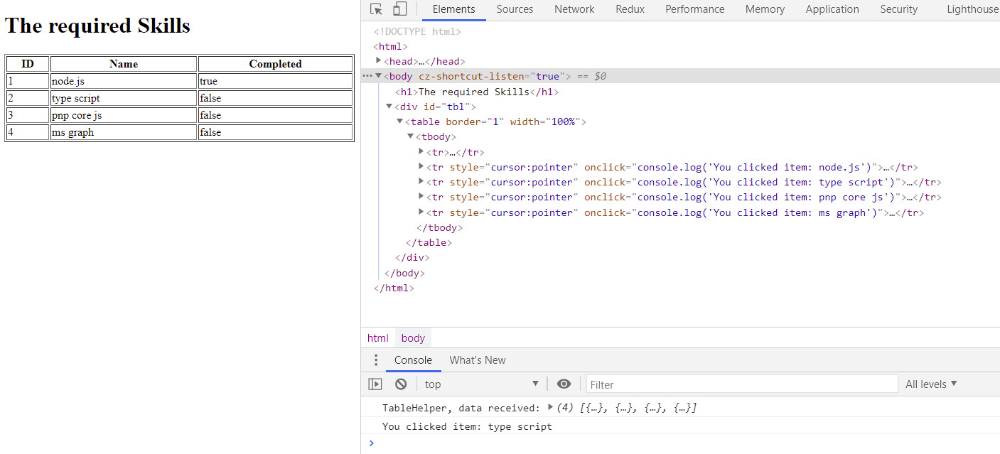

# Webstack & Language

```html
Take the following HTML as a starter:

<!DOCTYPE html>
<html>
  <head>
    <meta charset="UTF-8" />
    <meta name="viewport" content="width=device-width, initial-scale=1.0" />
    <script type="text/javascript" src="dist/bundle.js"></script>
    <title>Skills Table</title>
  </head>

  <body>
    <h1>The required Skills</h1>
    <div id="tbl"></div>
  </body>
</html>
```

Create an auto generated Skills Table that similar to this one:



Serve this json using Json-Server:

```json
[
  { "id": 1, "name": "node.js", "completed": true },
  { "id": 2, "name": "type script", "completed": false },
  { "id": 3, "name": "pnp core js", "completed": false },
  { "id": 4, "name": "ms graph", "completed": false }
]
```

- Use TypeScript and Webpack
- Create a SPRest Class that consumes Json-Server
- Create a TableHelper Class that builds the table

A possible solution is provided in `skills-table-ts`
